[วิธีติดตั้งและรันตั้งแต่ศูนย์](./INSTALL.md)
# SpaceLink

แพลตฟอร์มกลางจองพื้นที่ขายของและจัดกิจกรรม — Multi-tenant SaaS PWA · องค์กร (ตลาด / ห้าง / หน่วยงาน) สมัครเป็นผู้เช่าระบบ ออกแบบผังสถานที่ เปิดอีเวนต์ แล้วผู้ขายเลือกบูธ จอง แนบสลิป และได้รับการยืนยันอัตโนมัติ

> **โครงงานรายวิชา 1101910 โครงงานเทคโนโลยีดิจิทัล-1** · Software Engineering · 1/2569 · นำเสนอ 12–16 ตุลาคม 2569
> **กติกาการพัฒนาทั้งหมดอยู่ใน [`AGENTS.md`](./AGENTS.md)** · **สถานะงานอยู่ที่ Jira** ไม่เก็บในไฟล์นี้

ไฟล์นี้เป็น **แผนที่ระบบ** — ทุกโฟลเดอร์ ทุก endpoint ทุกหน้าจอ อย่างละบรรทัดเดียว เหตุผลเบื้องหลังกติกาอยู่ใน `AGENTS.md`

---

## 1. โครงสร้างโปรเจกต์

```
spacelink/
├─ apps/api/                    NestJS + Prisma → Render
│  ├─ prisma/
│  │  ├─ schema.prisma          v4 + ข้อยกเว้นที่ PO อนุมัติ (AGENTS.md §2.1.1) — 34 โมเดล 22 enum ห้ามแก้โดยไม่ผ่านทีม
│  │  ├─ seed.ts                ข้อมูลเดโมหลายองค์กร เรียงตามลำดับ FK — รันในเครื่องตัวเองเท่านั้น
│  │  ├─ migrations/            20 migrations
│  │  └─ sql/                   3 ไฟล์ apply ด้วยคน + 1 review-only (§4)
│  └─ src/                      28 โฟลเดอร์
│     ├─ auth/                  guard + JIT provisioning + decorator `@OrgScoped` + `OrgPermissionGuard`
│     ├─ users/                 ผู้ใช้ทั้งระบบ (SUPER_ADMIN) + แก้โปรไฟล์ตัวเอง + ตั้งค่าการแจ้งเตือน
│     ├─ organizations/         องค์กร · OWNER/ADMIN · สิทธิ์ย่อย · โควตา · PromptPay · สร้าง venue
│     ├─ venues/                ผังสถานที่ — อ่าน / แก้ / ลบ + สร้างโซนใต้ venue
│     ├─ zones/                 โซนในผัง
│     ├─ booths/                บูธในโซน
│     ├─ events/                อีเวนต์ · lifecycle · ใบเสนอราคา · slug · แบนเนอร์/แกลเลอรี · ข้อมูลอีเวนต์ · บันทึกอีเวนต์ · ทำอีเวนต์ซ้ำ / รูปผังอ้างอิง
│     ├─ categories/            หมวดสินค้า อ่านอย่างเดียว
│     ├─ bookings/              จอง (เดี่ยว / หลายบูธ) · กลุ่มชำระเงิน · สลิป · ยกเลิก · ยกเว้นค่าเช่า · cron หมดเวลา
│     ├─ transactions/          ธุรกรรมขององค์กร + timeline รายการจอง
│     ├─ slips/                 seam ตรวจสลิป — mock / manual / slipok (มี README เอง)
│     ├─ refunds/               คำร้องคืนเงิน + ช่องทางรับเงินคืน PromptPay + สลิปโอนคืน
│     ├─ reviews/               รีวิวผูกกับการจอง + ซ่อน / คืน / ลบ โดยแอดมิน
│     ├─ shops/                 ร้านค้าของผู้ขาย + โลโก้
│     ├─ notifications/         แจ้งเตือนในแอป + ส่ง web push ตามการตั้งค่าของผู้ใช้
│     ├─ push-subscriptions/    ลงทะเบียน/ถอน subscription ของเบราว์เซอร์
│     ├─ announcements/         ประกาศระดับองค์กร
│     ├─ system-broadcasts/     ประกาศกลางถึงผู้ใช้ทุกคน
│     ├─ penalties/             แต้มโทษ + trust score + แบล็กลิสต์
│     ├─ support-tickets/       คำร้องช่วยเหลือ + คำขอเกินโควตา (อนุมัติ = ออก `BoothQuotaGrant`)
│     ├─ audit-logs/            บันทึกการกระทำของผู้ดูแล
│     ├─ platform-config/       สูตรราคาค่าบริการอีเวนต์ของแพลตฟอร์ม
│     ├─ ai/                    seam แนะนำโซน + แชตช่วยเหลือ (มี README เอง)
│     ├─ dashboard/             สรุปตัวเลของค์กร
│     ├─ health/                liveness + readiness ของฐานข้อมูล
│     ├─ prisma/                `PrismaService` — ต่อ DB แบบ lazy ไม่ต่อตอน boot
│     ├─ common/                decorator · exception filter · pipe · ตัวช่วย Decimal
│     └─ config/                ตรวจ env ตอน boot (`env.validation.ts`)
├─ apps/web/                    Next.js 14 App Router PWA → Vercel
│  ├─ app/
│  │  ├─ layout.tsx             ครอบทุกหน้าด้วย `AppShell`
│  │  ├─ page.tsx               หน้าหลัก — ค้นหา Event + ประกาศสาธารณะ
│  │  ├─ login/ · register/     Email OTP · เข้าแล้วเด้งตาม role
│  │  ├─ events/[eventId]/      รายละเอียดอีเวนต์
│  │  │  ├─ map/                ผังโซนและบูธ
│  │  │  └─ book/               ฟอร์มจองบูธ
│  │  ├─ bookings/              การจองของฉัน
│  │  │  ├─ [bookingId]/        รายละเอียด · `payment/` สลิป+QR · `review/` รีวิว
│  │  │  └─ payment-groups/     `[paymentGroupId]/payment/` จ่ายรวมหลายบูธด้วยสลิปเดียว
│  │  ├─ refunds/               คำขอคืนเงินของฉัน
│  │  ├─ reviews/               รีวิวของฉัน
│  │  ├─ notifications/         แจ้งเตือน + ตัวกรอง + ตั้งค่ารายหมวด
│  │  ├─ profile/               โปรไฟล์ (จังหวัด) + ร้านค้า
│  │  ├─ help/                  FAQ + ค้นหา
│  │  ├─ support/               ส่งคำร้อง + ดูเธรด
│  │  ├─ privacy/ · terms/ · accessibility/   หน้าข้อกำหนดและนโยบาย
│  │  ├─ offline/               หน้าสำรองของ PWA ตอนไม่มีเน็ต
│  │  ├─ admin/                 ORG_ADMIN — 13 หน้า
│  │  │  ├─ dashboard/          ตัวเลขภาพรวมองค์กร
│  │  │  ├─ events/             สร้าง / แก้ / เผยแพร่ / ปิด / ลบ + ใบเสนอราคา + ข้อมูลอีเวนต์ + ทำอีเวนต์ซ้ำ / รูปผังอ้างอิง
│  │  │  ├─ bookings/           รายการจองขององค์กร
│  │  │  ├─ booking-rescue/     ค้นจากรหัสจอง → ยืนยันยกเว้นค่าเช่า / ออกแต้มโทษ
│  │  │  ├─ transactions/       ธุรกรรม + `bookings/[bookingId]/` timeline รายการจอง
│  │  │  ├─ quota-requests/     คำขอจองเกินโควตา — อนุมัติ / ปฏิเสธ
│  │  │  ├─ zones/              จัดการโซนและบูธ
│  │  │  ├─ map-designer/       ออกแบบผังสถานที่
│  │  │  ├─ vendors/            ผู้ขายในองค์กร + ประวัติรายคน
│  │  │  ├─ payments/           การชำระเงิน / คืนเงิน + ดูสลิป
│  │  │  ├─ reviews/            รีวิว + ซ่อน / คืน / ลบ
│  │  │  ├─ announcements/      ประกาศถึงผู้ขาย
│  │  │  └─ organization/       โควตา · PromptPay · ทีมแอดมินและสิทธิ์ย่อย
│  │  └─ super-admin/           SUPER_ADMIN — 11 หน้า (รวมโปรไฟล์) · shell แยกทั้งชุด
│  │     ├─ layout.tsx          ครอบด้วย `SuperAdminShell` + guard ของตัวเอง
│  │     ├─ page.tsx            ภาพรวมข้ามองค์กร + ส่งประกาศกลาง
│  │     ├─ notifications/      แจ้งเตือนของ Super Admin
│  │     ├─ organizations/      องค์กรทั้งหมด · สถานะ · PromptPay · แต่งตั้ง OWNER
│  │     ├─ admins/             แอดมินองค์กร + มอบสิทธิ์แก้โควตา
│  │     ├─ users/              ผู้ใช้ทั้งหมด + รายละเอียด + last-login
│  │     ├─ events-bookings/    การจอง / การเงิน (`?tab=bookings|payments`)
│  │     ├─ support/            เคสช่วยเหลือ / moderation (`?tab=tickets|moderation`)
│  │     ├─ announcements/      ประกาศข้ามองค์กร + ลบ
│  │     ├─ audit-logs/         audit log + ตัวกรอง
│  │     ├─ profile/            โปรไฟล์ ใช้ `ProfileShopScreen` ร่วมกัน
│  │     └─ settings/           สูตรราคาค่าบริการของแพลตฟอร์ม
│  ├─ components/               44 ไฟล์ (42 .tsx + 1 .ts + 1 .css) + `super-admin/` อีก 10 (§6)
│  ├─ lib/                      38 ไฟล์ที่ไม่ใช่เทสต์ + `*.test.ts` 51 ไฟล์ (§6)
│  └─ public/                   icon.svg · manifest.webmanifest · push-sw.js · `brand/` · รูปหน้าแรกและอีเวนต์
├─ prototype/                   prototype เดิม ใช้อ้างอิงเท่านั้น ห้ามแก้ ห้าม import
├─ .github/                     ci.yml · keep-alive.yml · CODEOWNERS · PR template
└─ AGENTS.md · CLAUDE.md · README.md · INSTALL.md
```

สอง app แยกกันสมบูรณ์ ไม่ใช่ npm workspaces — `cd` เข้าโฟลเดอร์ก่อนรัน npm ทุกครั้ง ห้ามมี `package.json` ที่ราก

`/admin` กับ `/super-admin` เป็นคนละ route tree คนละ shell โดยตั้งใจ — `app-shell.tsx` เจอ `/super-admin` แล้ว bypass ตัวเองทันที ปล่อยให้ `SuperAdminShell` ครอบแทน ซึ่งเช็ค `auth.role !== 'SUPER_ADMIN'` ของตัวเอง

---

## 2. API surface

ทุก path มี prefix `/api` · role คือขั้นต่ำที่เรียกได้ · **ORG_ADMIN+** = ORG_ADMIN ขององค์กรนั้น หรือ SUPER_ADMIN · **ล็อกอิน** = role ไหนก็ได้ที่มี token

**สิทธิ์ย่อย** (`OrgPermissionGuard`) — **`[P]`** = ต้องมี `canManagePayments` · **`[Z]`** = ต้องมี `canManageZones` · OWNER และ SUPER_ADMIN ผ่านเสมอ · องค์กรที่ยังไม่มี OWNER ให้ ADMIN ผ่านไปก่อนจนกว่าจะแต่งตั้ง

| โมดูล | endpoint | สิทธิ์ |
|---|---|---|
| `auth` | `GET /auth/me` — โปรไฟล์ + ร้าน + องค์กรที่สังกัด | ล็อกอิน |
| `users` | `GET /users` · `/:id` · `/:id/last-login` · `/:id/audit-logs` | SUPER_ADMIN |
| | `PATCH /users/me` — แก้ `phone` · `province` ไม่มี `:id` | ล็อกอิน |
| | `GET`/`PATCH /users/me/notification-preferences` — เปิด/ปิดรายหมวด | ล็อกอิน |
| `organizations` | `GET /organizations` · `/:id` | public |
| | `POST /organizations` · `GET /export` · `PATCH /:id/status` · `PATCH /:id/owner` | SUPER_ADMIN |
| | `GET /:organizationId/admins` | ORG_ADMIN+ |
| | `POST /:organizationId/admins` · `DELETE /:organizationId/admins/:userId` · `PATCH .../admins/:membershipId/permissions` | ORG_ADMIN (OWNER มอบสิทธิ์ย่อย) |
| | `PATCH /:organizationId` `[P]` · `PATCH /:organizationId/quota` | ORG_ADMIN+ · quota ต้องมี `canEditQuota` |
| | `POST /organizations/:organizationId/venues` `[Z]` | ORG_ADMIN+ |
| | `GET /admins` · `PATCH /admins/:membershipId/quota-permission` | SUPER_ADMIN |
| `venues` | `GET /venues` · `/venues/:id` | public |
| | `PATCH`/`DELETE /venues/:venueId` · `POST /venues/:venueId/zones` `[Z]` | ORG_ADMIN+ |
| `zones` | `GET /zones` · `/zones/:id` | public |
| | `PATCH`/`DELETE /zones/:zoneId` · `POST /zones/:zoneId/booths` `[Z]` | ORG_ADMIN+ |
| `booths` | `GET /booths` · `/booths/:id` | public |
| | `PATCH`/`DELETE /booths/:boothId` `[Z]` | ORG_ADMIN+ |
| `events` | `GET /events` · `/events/discovery` · `/events/:id/map` · `/events/by-slug/:slug/map` | public |
| | `GET /events/saved` · `POST`/`DELETE /events/:id/save` | ล็อกอิน |
| | `POST /organizations/:organizationId/events` · `POST .../events/quote` · `GET` · `PATCH :eventId` | ORG_ADMIN+ |
| | `PATCH :eventId/publish` · `/open` · `/close` · `DELETE :eventId` | ORG_ADMIN+ |
| | `POST :eventId/gallery` · `POST`/`DELETE :eventId/banner` | ORG_ADMIN+ |
| | `POST /organizations/:organizationId/events/:eventId/repeat/quote` · `POST /organizations/:organizationId/events/:eventId/repeat` | ORG_ADMIN |
| | `POST`/`DELETE /organizations/:organizationId/events/:eventId/map-image` | ORG_ADMIN+ |
| | `POST`/`PATCH`/`DELETE :eventId/join-information` · `:eventId/information` + `/reorder` | ORG_ADMIN |
| | `PATCH :eventId/subscription/activate` | SUPER_ADMIN |
| `categories` | `GET /categories` | public |
| `bookings` | `POST /bookings` · `POST /bookings/batch` · `GET /quota/:eventId` · `GET /bookings` | VENDOR |
| | `POST /:id/slip` · `PATCH /:id/cancel` | VENDOR |
| | `GET /payment-groups/:paymentGroupId` · `POST .../slip` — จ่ายรวมหลายบูธ | VENDOR |
| | `GET /by-code/:bookingCode` | ORG_ADMIN+ |
| | `GET /:bookingId` · `/:bookingId/slip` · `PATCH /:bookingId/confirm-exempt` · `/status` `[P]` | ORG_ADMIN+ |
| | `GET /organizations/:id/bookings` `[P]` | ORG_ADMIN+ |
| | `GET /bookings/all` | SUPER_ADMIN |
| `transactions` | `GET /organizations/:id/transactions` · `/bookings/:bookingId` `[P]` | ORG_ADMIN+ |
| `refunds` | `POST /bookings/:bookingId/refunds` · `POST /refunds/batch` · `GET /refunds/mine` · `GET /refunds/:refundId/payout-slip-url` | VENDOR |
| | `PATCH .../approve` · `/reject` · `/process` · `POST .../payout-slip` · `GET /organizations/:id/refunds` `[P]` | ORG_ADMIN+ |
| | `GET /refunds/all` | SUPER_ADMIN |
| `reviews` | `GET /reviews/average` · `GET /reviews/events/:eventId` | public |
| | `POST /reviews` · `GET /reviews/me` | VENDOR |
| | `GET /reviews/organizations/:id` · `PATCH /:reviewId/hide` · `/restore` · `DELETE /:reviewId` | ORG_ADMIN+ |
| `shops` | `POST /shops` · `PATCH /shops/me` · `POST /shops/me/logo` (multipart) | VENDOR |
| `notifications` | `GET /notifications` · `/unread-count` · `PATCH /mark-all-read` · `/:id/read` | ล็อกอิน |
| | `DELETE /notifications/:notificationId` | SUPER_ADMIN |
| `push-subscriptions` | `POST` · `DELETE /push-subscriptions` | ล็อกอิน |
| `announcements` | `GET /organizations/:id/announcements` | public |
| | `GET /:id/announcements/admin` · `POST` · `PATCH` · `DELETE` | ORG_ADMIN+ |
| | `GET /announcements/all` · `DELETE /announcements/:id` ข้ามองค์กร | SUPER_ADMIN |
| `system-broadcasts` | `GET /system-broadcasts/active` | ล็อกอิน |
| | `POST /system-broadcasts` — ถึงผู้ใช้ทุกคน | SUPER_ADMIN |
| `penalties` | `POST` · `GET /bookings/:bookingId/penalties` | ORG_ADMIN+ |
| | `POST /penalties` (ออกให้ผู้ขายตรง) · `GET /penalties/all` | SUPER_ADMIN |
| `support-tickets` | `POST /support-tickets` · `GET /my` · `GET /my/:ticketId` | VENDOR |
| | `POST /support-tickets/organizations/:id` — คำร้องถึง Super Admin | ORG_ADMIN |
| | `GET /organizations/:id` · `/organizations/:id/:ticketId` | ORG_ADMIN+ |
| | `PATCH /:ticketId/approve-quota-exception` · `/reject-quota-exception` | ORG_ADMIN+ |
| | `GET /all` · `GET /:ticketId` · `PATCH /:ticketId/status` | SUPER_ADMIN |
| `audit-logs` | `GET /audit-logs?action=&actorUserId=` | SUPER_ADMIN |
| `platform-config` | `GET` · `PATCH /platform-config` | SUPER_ADMIN |
| `ai` | `POST /events/:eventId/recommendations` · `POST /ai/support` | ล็อกอิน |
| `dashboard` | `GET /organizations/:organizationId/dashboard-summary` | ORG_ADMIN+ |
| `health` | `GET /health` · `GET /health/db` | ไม่ต้อง auth |

---

## 3. กติกาที่บังคับในโค้ด

Prisma กับ foreign key แสดงกฎพวกนี้ไม่ได้ ทุกข้อบังคับใน service — เหตุผลเต็มอยู่ AGENTS.md §6.3

| กฎ | บังคับที่ไหน |
|---|---|
| บูธต้องอยู่ใน venue เดียวกับอีเวนต์ | `bookings.service` ในทรานแซกชันสร้าง booking |
| วันที่จองต้องอยู่ในช่วงอีเวนต์ | เดียวกัน |
| 1 บูธ 1 อีเวนต์ มี booking ที่ยัง active ได้ใบเดียว | service + partial unique index `booking_active_event_booth_key` (apply บนฐานข้อมูลทีมแล้ว) |
| องค์กรเจ้าของอีเวนต์ต้อง `ACTIVE` | สร้าง booking · หน้า discovery · หน้าผัง · `OrgScopeGuard` |
| ไม่เกินโควตาต่อผู้ขายต่ออีเวนต์ | `org_config` ก่อน ตกไป `platform_config` (default 2) |
| จองเกินโควตาได้ 1 booking ต่อ 1 `BoothQuotaGrant` · อนุมัติคำขอ = ออกสิทธิ์ **ไม่สร้าง booking ให้** · grant หมดอายุไปพร้อมอีเวนต์ | `support-tickets.service` + `bookings.service` (`consumedBookingId` unique กันใช้ซ้ำ) |
| จองหลายบูธพร้อมกันได้เฉพาะผู้ขาย ร้าน และอีเวนต์เดียวกัน · จ่ายรวมด้วยสลิปเดียว · สลิปผ่าน = ยืนยันทุกบูธในกลุ่มพร้อมกัน | `bookings.service` (`BookingPaymentGroup`) |
| ผู้ใช้ที่ติดแบล็กลิสต์จองไม่ได้ | สร้าง booking + เด้งตั้งแต่หน้า login |
| trust score เริ่ม 100 แต้มโทษ**หัก**ออก clamp ที่ 0 แตะ 0 = แบล็กลิสต์ | `penalties.service` serializable transaction retry 3 |
| ยอดสลิปต้องตรงราคาบูธ **และ** สถานะต้องเป็น `VERIFIED` ก่อนถึงเทียบยอด | `bookings.service` เทียบ Decimal ด้วย `.equals()` |
| `trans_ref` ห้ามซ้ำ (กันสลิปซ้ำ) | unique ใน schema |
| hold 5 นาที หมดแล้วยกเลิกด้วย `cancelledByRole = SYSTEM` | cron ทุกนาทีใน `bookings/` |
| ยอดคืนเงินที่อนุมัติ ≤ ราคาบูธ และ ≤ ยอดที่ขอ · ถ้าจ่ายแบบกลุ่ม ยอดคืนรวมทั้งกลุ่ม ≤ `totalAmount` ของกลุ่ม | `refunds.service` |
| คืนเงินได้เฉพาะ booking ที่ยกเลิกแล้ว ไม่ใช่ exempt และมีสลิป verified ยอดตรง | `refunds.service` |
| คำขอคืนเงินใหม่ต้องมี PromptPay ID ที่ถูกต้อง · ระบบใช้ชื่อผู้โอนจากสลิปชำระเงิน VERIFIED เป็นชื่อผู้รับเงินคืน; หากไม่พบชื่อจะปฏิเสธคำขอ และชื่อที่ client ส่งมาต้องตรงกับชื่อจากสลิป · ข้อมูลเก่าที่ไม่มีชื่อยังอ่านได้ · สลิปโอนคืนต้องตรงยอดที่อนุมัติ และผลชื่อไม่ตรง/ตรวจชื่อไม่ได้แสดงเป็นคำเตือน | `refunds.service` · `refund-slip-verification.service` |
| รีวิวได้เมื่ออีเวนต์จบแล้ว (เวลาไทย ไม่ระบุเวลาจบ = 23:59) · 1 รีวิวต่อ 1 booking · รีวิวที่ถูกลบส่งใหม่ไม่ได้ | `reviews.service` |
| ซ่อน / คืน / ลบรีวิว เดินตามสถานะ `PUBLISHED` ↔ `HIDDEN` → `DELETED` + บันทึก audit log | `reviews.service` |
| เปลี่ยนโลโก้ร้านได้ **1 ครั้งต่อ 168 ชั่วโมง** | `shops.service` ล็อกแถวด้วย `SELECT … FOR UPDATE` |
| ลบโซน/บูธไม่ได้ถ้าเคยมี booking ผูกอยู่ (แม้ถูกยกเลิกแล้ว) | FK restrict แล้วแปล error เป็นไทย |
| ลบอีเวนต์ได้เฉพาะที่ยังไม่เคยมี booking | `events.service` |
| สถานะคำร้องเดินหน้าอย่างเดียว OPEN → IN_PROGRESS → CLOSED | `support-tickets.service` |
| `platform_config` เขียนได้เฉพาะ SUPER_ADMIN · `org_config` เฉพาะแอดมินองค์กรนั้น | guard + service |
| SUPER_ADMIN แต่งตั้ง/เปลี่ยน OWNER ได้ แต่มอบสิทธิ์ `canManagePayments` / `canManageZones` ไม่ได้ — เป็นของ OWNER เท่านั้น | `organizations.service` + `OrgPermissionGuard` |

**คำนวณสด ไม่เก็บเป็นค่าจริง** — tier บูธ (S/A/B/C) จากราคา · badge ร้าน · คะแนนเฉลี่ย

**กฎที่พลาดแล้วไม่มี error ให้เห็น**

- org-scoped route ตอบ **404 ไม่ใช่ 403** — ของที่ไม่มีจริงกับของขององค์กรอื่นต้องแยกไม่ออกจากฝั่ง client
- `organizationId` มาจาก `OrgMembership` เสมอ ไม่เอาจาก path / query / body
- role กับ membership อ่านจากฐานข้อมูล **ไม่ใช่จาก JWT claim**
- ใช้ `@OrgScoped(param)` ตัวเดียว ห้ามแยกเป็น `@OrgScope` + `@UseGuards` (แยกแล้วคอมไพล์ผ่าน เทสต์ผ่าน แต่ไม่บังคับอะไรเลย)
- เงินเป็น `Decimal(10,2)` คืนออก API ด้วย `.toString()` ห้าม `Float`/`parseFloat`
- ห้าม `$queryRawUnsafe` / `$executeRawUnsafe`
- `verified_slip.slipok_raw` มีชื่อและธนาคารผู้โอน — ห้ามคืนให้ผู้ขายและห้าม log
- `SUPABASE_SERVICE_ROLE_KEY` ห้ามโผล่ใน `apps/web` หรือตัวแปร `NEXT_PUBLIC_*` ใดๆ

---

## 4. ฐานข้อมูลและ migration

- โมเดล = PascalCase · ตาราง/คอลัมน์ = snake_case ผ่าน `@@map` / `@map` · ใน TypeScript ใช้ชื่อของ Prisma เสมอ
- โมเดล `User` map ไปตาราง **`app_user`** (`user` เป็นคำสงวนของ Postgres)
- PK เป็น uuid · เวลาเป็น timestamptz · เงินเป็น `Decimal(10,2)`
- สายความเป็นเจ้าของ: `Organization` → `Venue` → `Zone` → `Booth` → `Booking` · `Event` คือสิ่งที่ถูกจองเข้าไป · `Subscription` คือบิลที่องค์กรจ่ายให้แพลตฟอร์ม (คนละเรื่องกัน)
- migration รันโดยคน ไม่ใช่ agent · **ห้าม** `migrate reset` / `db push` / `db pull` / `DROP` / `TRUNCATE`
- `npx prisma generate` และ `npx prisma validate` ปลอดภัยเสมอ

**`prisma/sql/` — Prisma ไม่รันไฟล์เหล่านี้: apply เฉพาะสามไฟล์แรกด้วย `psql` หลัง migrate; ไฟล์ SCRUM-144 ไว้รีวิวเท่านั้น**

| ไฟล์ | ทำอะไร |
|---|---|
| `booking_active_event_booth_unique.sql` | partial unique index กัน double-booking (`@@unique` เงื่อนไขตามสถานะไม่ได้) |
| `remove_authenticated_slips_upload_policy.sql` | ถอน policy ที่ยอมให้ client ที่ล็อกอินอัปโหลดเข้าบัคเก็ต `slips` ตรงๆ |
| `enable_rls_saved_event.sql` | เปิด RLS แบบ deny-by-default ให้ `saved_event` เหมือนตารางใหม่อื่นๆ |
| `scrum-144-refund-payout-review.sql` | **ไว้รีวิวเท่านั้น** — SQL ของ SCRUM-144 ที่ gen จาก `migrate diff` ห้ามรันรวมกับไฟล์อื่น (Book เป็นคน apply) |

ทั้งสามไฟล์แรก apply บนฐานข้อมูลทีมแล้ว (ตรวจจาก `pg_indexes` / `pg_class` เมื่อ 27 ก.ย. 2569) — ฐานข้อมูลใหม่ของใครก็ตามยังต้อง apply เองหลัง migrate

### ERD

34 ตาราง · 63 ความสัมพันธ์ · สร้างจากฐานข้อมูลจริงของทีม (Supabase `database.types.ts`) เมื่อ 27 ก.ย. 2569 แล้วตัดให้เหลือเฉพาะคีย์

- แสดงเฉพาะ PK / FK — คอลัมน์ครบ ชนิดข้อมูล และ enum ดูที่ `apps/api/prisma/schema.prisma` (แหล่งความจริงเดียวของโครงสร้าง)
- เส้นทึบ = FK บังคับ (`NOT NULL`) · เส้นประ = FK ที่เป็น null ได้ · `||--o|` = 1 ต่อ 1 (FK เป็น unique)
- ไม่มีตาราง `auth.users` ของ Supabase — `app_user.auth_user_id` อ้างถึงมันโดยไม่มี FK จริง

```mermaid
erDiagram
    announcement {
        uuid announcement_id PK
        uuid event_id FK
        uuid organization_id FK
    }
    app_user {
        uuid user_id PK
    }
    audit_log {
        uuid audit_log_id PK
        uuid actor_user_id FK
    }
    booking {
        uuid booking_id PK
        uuid booth_id FK
        uuid cancelled_by_user_id FK
        uuid event_id FK
        uuid payment_group_id FK
        uuid shop_id FK
        uuid vendor_user_id FK
    }
    booking_payment_group {
        uuid payment_group_id PK
        uuid event_id FK
        uuid organization_id FK
        uuid shop_id FK
        uuid vendor_user_id FK
    }
    booth {
        uuid booth_id PK
        uuid zone_id FK
    }
    booth_quota_grant {
        uuid quota_grant_id PK
        uuid consumed_booking_id FK
        uuid event_id FK
        uuid granted_by_user_id FK
        uuid organization_id FK
        uuid source_ticket_id FK
        uuid vendor_user_id FK
    }
    event {
        uuid event_id PK
        uuid organization_id FK
        uuid venue_id FK
    }
    event_information {
        uuid event_information_id PK
        uuid event_id FK
    }
    event_join_information {
        uuid event_join_information_id PK
        uuid event_id FK
    }
    event_policy {
        uuid event_policy_id PK
        uuid event_id FK
    }
    notification {
        uuid notification_id PK
        uuid user_id FK
    }
    org_config {
        uuid org_config_id PK
        uuid organization_id FK
    }
    org_membership {
        uuid membership_id PK
        uuid organization_id FK
        uuid user_id FK
    }
    organization {
        uuid organization_id PK
    }
    penalty {
        uuid penalty_id PK
        uuid booking_id FK
        uuid organization_id FK
        uuid user_id FK
    }
    platform_config {
        uuid platform_config_id PK
    }
    product_category {
        uuid category_id PK
    }
    push_subscription {
        uuid push_subscription_id PK
        uuid user_id FK
    }
    recommendation_log {
        uuid recommendation_log_id PK
        uuid event_id FK
        uuid recommended_booth_id FK
        uuid vendor_user_id FK
    }
    refund_request {
        uuid refund_request_id PK
        uuid booking_id FK
        uuid requested_by_user_id FK
        uuid reviewed_by_user_id FK
    }
    review {
        uuid review_id PK
        uuid booking_id FK
        uuid event_id FK
        uuid organization_id FK
        uuid reviewer_user_id FK
    }
    saved_event {
        uuid saved_event_id PK
        uuid event_id FK
        uuid user_id FK
    }
    shop {
        uuid shop_id PK
        uuid owner_user_id FK
    }
    shop_category {
        uuid category_id PK, FK
        uuid shop_id PK, FK
    }
    subscription {
        uuid subscription_id PK
        uuid event_id FK
        uuid organization_id FK
    }
    support_ticket {
        uuid support_ticket_id PK
        uuid booking_id FK
        uuid organization_id FK
        uuid user_id FK
    }
    system_broadcast {
        uuid system_broadcast_id PK
        uuid created_by_user_id FK
    }
    ticket_message {
        uuid ticket_message_id PK
        uuid sender_user_id FK
        uuid ticket_id FK
    }
    venue {
        uuid venue_id PK
        uuid organization_id FK
    }
    venue_point {
        uuid venue_point_id PK
        uuid venue_id FK
    }
    verified_slip {
        uuid slip_id PK
        uuid booking_id FK
        uuid payment_group_id FK
    }
    zone {
        uuid zone_id PK
        uuid venue_id FK
    }
    zone_category {
        uuid category_id PK, FK
        uuid zone_id PK, FK
    }
    app_user ||--o{ audit_log : actor_user_id
    app_user ||--o{ booking : vendor_user_id
    app_user ||--o{ booking_payment_group : vendor_user_id
    app_user ||--o{ booth_quota_grant : granted_by_user_id
    app_user ||--o{ booth_quota_grant : vendor_user_id
    app_user ||--o{ notification : user_id
    app_user ||--o{ org_membership : user_id
    app_user ||--o{ penalty : user_id
    app_user ||--o{ push_subscription : user_id
    app_user ||--o{ recommendation_log : vendor_user_id
    app_user ||--o{ refund_request : requested_by_user_id
    app_user ||--o{ saved_event : user_id
    app_user ||--o{ shop : owner_user_id
    app_user ||--o{ support_ticket : user_id
    app_user ||--o{ system_broadcast : created_by_user_id
    app_user ||--o{ ticket_message : sender_user_id
    app_user ||..o{ booking : cancelled_by_user_id
    app_user ||..o{ refund_request : reviewed_by_user_id
    app_user ||..o{ review : reviewer_user_id
    booking ||--o{ refund_request : booking_id
    booking ||--o{ verified_slip : booking_id
    booking ||..o{ penalty : booking_id
    booking ||..o{ support_ticket : booking_id
    booking ||..o| booth_quota_grant : consumed_booking_id
    booking ||..o| review : booking_id
    booking_payment_group ||..o{ booking : payment_group_id
    booking_payment_group ||..o{ verified_slip : payment_group_id
    booth ||--o{ booking : booth_id
    booth ||--o{ recommendation_log : recommended_booth_id
    event ||--o{ booking : event_id
    event ||--o{ booking_payment_group : event_id
    event ||--o{ booth_quota_grant : event_id
    event ||--o{ event_information : event_id
    event ||--o{ event_join_information : event_id
    event ||--o{ recommendation_log : event_id
    event ||--o{ saved_event : event_id
    event ||--o| event_policy : event_id
    event ||--o| subscription : event_id
    event ||..o{ announcement : event_id
    event ||..o{ review : event_id
    organization ||--o{ announcement : organization_id
    organization ||--o{ booking_payment_group : organization_id
    organization ||--o{ booth_quota_grant : organization_id
    organization ||--o{ event : organization_id
    organization ||--o{ org_membership : organization_id
    organization ||--o{ penalty : organization_id
    organization ||--o{ subscription : organization_id
    organization ||--o{ venue : organization_id
    organization ||--o| org_config : organization_id
    organization ||..o{ review : organization_id
    organization ||..o{ support_ticket : organization_id
    product_category ||--o{ shop_category : category_id
    product_category ||--o{ zone_category : category_id
    shop ||--o{ booking : shop_id
    shop ||--o{ booking_payment_group : shop_id
    shop ||--o{ shop_category : shop_id
    support_ticket ||--o{ ticket_message : ticket_id
    support_ticket ||--o| booth_quota_grant : source_ticket_id
    venue ||--o{ event : venue_id
    venue ||--o{ venue_point : venue_id
    venue ||--o{ zone : venue_id
    zone ||--o{ booth : zone_id
    zone ||--o{ zone_category : zone_id
```



---

## 5. Auth และ role

Supabase Auth เป็นผู้ออก token · NestJS แค่ verify ไม่ได้ออกเอง · ไม่มี `/auth/register`, `/auth/login`, ไม่มี bcrypt, ไม่มี `passwordHash`

1. เบราว์เซอร์เรียก `signInWithOtp({ email })` กับ Supabase โดยตรงเพื่อส่ง OTP แล้วเรียก `verifyOtp({ email, token, type: 'email' })` เพื่อรับ session ที่มี JWT
2. ทุก request แนบ `Authorization: Bearer <supabase_jwt>`
3. `SupabaseAuthGuard` verify ลายเซ็นแล้วดึง `sub` = `app_user.auth_user_id`
4. ถ้ายังไม่มีแถว `app_user` → **JIT-provision** ให้ (role เริ่มต้น VENDOR เสมอ)
5. `RolesGuard` อ่าน `app_user.role` **จากฐานข้อมูล**
6. `OrgScopeGuard` เช็ค `OrgMembership` **จากฐานข้อมูล** สำหรับ route ที่ผูกองค์กร

`UserRole` = `SUPER_ADMIN | ORG_ADMIN | VENDOR` (ระดับแพลตฟอร์ม) · `OrgMembership.role` = `OWNER | ADMIN` (บอกว่าทำกับองค์กรไหนได้) — ทั้งคู่อยู่ในฐานข้อมูลของเรา **ไม่เคยอยู่ใน JWT**

หลังยืนยัน OTP: SUPER_ADMIN → `/super-admin` · ORG_ADMIN → `/admin/bookings` · VENDOR → `/` · บัญชีที่ติดแบล็กลิสต์ถูก sign out ทันทีโดยไม่บอกเหตุผล

---

## 6. ไฟล์ฝั่งเว็บ

### `lib/`

| ไฟล์ | ทำอะไร |
|---|---|
| `api.ts` | client เดียวของทั้งแอป — ทุก endpoint + type · read สาธารณะไม่แนบ Authorization |
| `supabase.ts` | Supabase browser client แบบ **lazy** — สร้างตอนใช้จริง ไม่ใช่ตอน import (ไม่งั้น build พังตอนไม่มี env) |
| `use-auth-state.ts` | สถานะล็อกอิน + role + องค์กร มี `loading` เป็นสถานะของตัวเองกันหน้าจอกระพริบ |
| `use-email-otp.ts` | flow ส่ง/ยืนยัน OTP + cooldown + เด้งตาม role หลังล็อกอิน |
| `use-vendor-profile.ts` | โปรไฟล์ + ร้านของผู้ขาย (ผู้ขายมีได้ร้านเดียว จึงยุบ `shops[]` ให้ตรงนี้ที่เดียว) |
| `auth-errors.ts` | ข้อความ error ของหน้า login/register เก็บที่เดียวกันสองหน้าไม่ให้เพี้ยน |
| `event-booking-rules.ts` | อีเวนต์นี้ยังจองได้ไหม — เช็คสถานะ + วันที่ตามเวลาไทย |
| `ux-preview.ts` | โหมดพรีวิว UI **เฉพาะ dev บน localhost** ไม่เคยสร้าง token ที่ API รับ |
| `event-time.ts` | อีเวนต์จบแล้วหรือยัง ตามเวลาไทย — ใช้ตัดสินสิทธิ์รีวิว |
| `event-cover.ts` · `facebook-embed.ts` | รูปปกอีเวนต์ + fallback · แยกประเภทลิงก์ Facebook ของผู้จัด |
| `home-event-filters.ts` · `home-announcement-filters.ts` | ตัวกรองหน้าแรก — จังหวัด / พื้นที่ / ประกาศ |
| `saved-events.ts` | รายการอีเวนต์ที่บันทึกไว้ |
| `booth-selection-policy.ts` | ใครเลือกบูธได้ + เช็คโควตาก่อนเลือก แยกจากการ render |
| `use-booking-quota.ts` · `booking-quota-request.ts` | อ่านโควตาจาก server + timeout กัน API ค้าง |
| `quota-request-context.ts` | บริบทของคำขอจองเกินโควตาจาก query string |
| `booking-summary-image.ts` | สร้างรูป PNG สรุปการจองให้ดาวน์โหลด |
| `refund-request-policy.ts` · `refund-notification-route.ts` | ขอคืนเงินได้ไหม + ยอดที่ถูกต้อง · ลิงก์จากแจ้งเตือนคืนเงิน |
| `review-eligibility.ts` | booking นี้รีวิวได้หรือยัง |
| `notification-settings-ui.ts` | สรุปและสไตล์สวิตช์ตั้งค่าแจ้งเตือนรายหมวด |
| `push-registration.ts` · `web-push-preview.ts` | สถานะการลงทะเบียน push · แจ้งเตือนตัวอย่างในแอป |
| `profile-province.ts` | normalize + ตรวจจังหวัดในโปรไฟล์ |
| `help-center.ts` | ค้นหา FAQ ในหน้าช่วยเหลือ |
| `admin-organization-access.ts` | รายการองค์กรที่แอดมินเลือกได้ + องค์กรที่เลือกอยู่ |
| `admin-transaction-filters.ts` · `admin-booking-timeline.ts` | ตัวกรองหน้าธุรกรรม (sync กับ URL) · ข้อความ timeline รายการจอง |
| `super-admin-notifications.ts` | ลิงก์ปลายทางของแจ้งเตือน Super Admin |
| `route-identifier.ts` | เช็คว่า path param เป็น UUID ไหม |
| `admin-access-state.ts` | แยกสถานะกำลังโหลด / อนุญาต / ไม่มีสิทธิ์ / ไม่มีองค์กร / ติดต่อระบบไม่ได้ |
| `event-detail-view-model.ts` | สรุปโซน ปุ่มหลัก และลิงก์/พิกัดแผนที่สำหรับรายละเอียดอีเวนต์ |
| `home-event-atmosphere.ts` | กรอง URL รูปบรรยากาศที่ใช้ได้บนหน้าแรก |
| `network-error.ts` | แยกปัญหาเครือข่ายจากคำตอบที่ไม่อนุญาต และเลือกข้อความการเชื่อมต่อ |
| `notification-toast-controller.ts` | คิว toast ของบัญชีที่ล็อกอินพร้อมอายุการแสดงผล |
| `repeat-event-dialog-keyboard.ts` | การใช้แป้นพิมพ์ใน dialog ทำอีเวนต์ซ้ำและคืน focus |

มีไฟล์ทดสอบ `*.test.ts` ใน `lib/` 51 ไฟล์

### `components/` — ส่วนกลาง

| ไฟล์ | ทำอะไร |
|---|---|
| `app-shell.tsx` | shell ของผู้ขาย/ORG_ADMIN — sidebar · bottom nav · แบนเนอร์ประกาศกลาง · วิดเจ็ต AI |
| `admin-ui.tsx` | ชิ้นส่วนร่วมของหน้า admin + `useAdminPageAccess` (เลือกองค์กร + เช็คสิทธิ์) |
| `auth-layout.tsx` | เลย์เอาต์เต็มจอของหน้า login / register |
| `auth-layout.module.css` | สไตล์เฉพาะของหน้า login/register |
| `event-details-popup.tsx` | popup รายละเอียดอีเวนต์จากหน้าแรก |
| `resilient-image.tsx` | คงเลย์เอาต์และภาพพื้นหลังสำรองเมื่อรูปโหลดไม่ได้ |
| `otp-input.tsx` · `otp-input-logic.ts` | ช่องกรอกรหัส 6 หลัก + ตรรกะ normalize / โฟกัส |
| `select-menu.tsx` · `multi-select-menu.tsx` | dropdown เดี่ยว / หลายค่า ใช้ร่วมทั้งแอป |
| `zone-map.tsx` | ผังโซนและบูธเป็น inline SVG — โซนต่างกันด้วยน้ำหนักสีม่วง ไม่ใช่คนละสี |
| `booking-countdown.tsx` | นับถอยหลัง hold 5 นาที |
| `slip-upload-panel.tsx` | แผงเลือกไฟล์ + อัปโหลดสลิป |
| `admin-slip-actions.tsx` | ปุ่มดู/ดาวน์โหลดสลิป — ขอ signed URL ตอนกดเท่านั้น |
| `service-worker-registrar.tsx` | ลงทะเบียน service worker ของ next-pwa |

### `components/` — จอผู้ขาย

| ไฟล์ | ทำอะไร |
|---|---|
| `event-detail-screen.tsx` | รายละเอียดอีเวนต์ + ข้อมูลติดต่อผู้จัด |
| `event-map-screen.tsx` | ผังบูธ + สถานะว่าง/ถูกจอง + tier |
| `booking-screen.tsx` | ฟอร์มจอง — เลือกบูธ วันที่ ร้าน |
| `my-bookings-screen.tsx` | รายการจองของฉัน + PromptPay QR |
| `booking-detail-screen.tsx` | รายละเอียดการจอง + ยกเลิก |
| `booking-payment-screen.tsx` | หน้าอัปโหลดสลิปและผลตรวจ |
| `booking-payment-group-screen.tsx` | จ่ายรวมหลายบูธด้วยสลิปเดียว |
| `refund-request-panel.tsx` · `my-refunds-screen.tsx` | ขอคืนเงิน + PromptPay รับเงินคืน · รายการคำขอคืนเงินของฉัน |
| `my-reviews-screen.tsx` | รีวิวของฉัน |
| `saved-events-section.tsx` | อีเวนต์ที่บันทึกไว้บนหน้าแรก |
| `booking-review-screen.tsx` | ให้คะแนนโซนและร้าน |
| `profile-shop-screen.tsx` | โปรไฟล์ + ร้าน + โลโก้ (ส่วนร้านแสดงเฉพาะ VENDOR) |
| `support-ticket-screen.tsx` | ส่งคำร้อง + ดูเธรดข้อความ |

### `components/` — จอ ORG_ADMIN

| ไฟล์ | ทำอะไร |
|---|---|
| `admin-dashboard.tsx` | ตัวเลขภาพรวมองค์กร |
| `admin-events-screen.tsx` | สร้าง/เผยแพร่/ปิด/ลบอีเวนต์ + ใบเสนอราคาค่าบริการ |
| `admin-bookings-screen.tsx` | รายการจองขององค์กร |
| `admin-transactions-screen.tsx` · `admin-booking-detail-screen.tsx` | ธุรกรรมขององค์กร · timeline รายการจอง |
| `admin-quota-requests-screen.tsx` | คำขอจองเกินโควตา — อนุมัติ / ปฏิเสธ |
| `admin-booking-rescue-screen.tsx` | ค้นจากรหัสจอง → ยืนยันยกเว้นค่าเช่า / ออกแต้มโทษ / ดูประวัติโทษ |
| `admin-zone-booth-screen.tsx` | จัดการโซนและบูธ |
| `admin-map-designer.tsx` | วางผังสถานที่ |
| `admin-vendors-screen.tsx` | ผู้ขายในองค์กร + ประวัติการจองรายคน |
| `admin-payments-screen.tsx` | การชำระเงิน + คืนเงิน + ดูสลิป |
| `admin-reviews-screen.tsx` | สรุปคะแนนรีวิว + ซ่อน / คืน / ลบ |
| `admin-announcements-screen.tsx` | ประกาศถึงผู้ขาย |
| `admin-organization-settings.tsx` | โควตาการจอง + PromptPay ขององค์กร |
| `admin-team-management.tsx` | ทีมแอดมิน — เพิ่ม / ถอด + OWNER มอบสิทธิ์การเงิน / โซน |

### `components/super-admin/`

| ไฟล์ | ทำอะไร |
|---|---|
| `super-admin-shell.tsx` | shell + sidebar + guard + กระดิ่งแจ้งเตือน |
| `super-admin-dashboard.tsx` | ภาพรวมข้ามองค์กร + ส่งประกาศกลาง |
| `super-admin-organizations-screen.tsx` | องค์กรทั้งหมด · สร้าง · สถานะ · PromptPay · แต่งตั้ง OWNER |
| `super-admin-admins-screen.tsx` | แอดมินองค์กรทั้งระบบ + มอบสิทธิ์แก้โควตา |
| `super-admin-users-screen.tsx` | ผู้ใช้ทั้งหมด + รายละเอียด + last-login |
| `super-admin-events-bookings-screen.tsx` | การจองและการเงินข้ามองค์กร |
| `super-admin-support-screen.tsx` | เคสช่วยเหลือ + แต้มโทษ/แบล็กลิสต์ |
| `super-admin-announcements-screen.tsx` | ประกาศข้ามองค์กร + ลบ |
| `super-admin-audit-logs-screen.tsx` | audit log + ตัวกรอง |
| `super-admin-platform-config-screen.tsx` | สูตรราคาค่าบริการอีเวนต์ |

---

## 7. Tech stack

| ส่วน | ใช้อะไร |
|---|---|
| Frontend | Next.js 14 (App Router) · React · Tailwind · next-pwa · inline SVG zone map |
| Backend | NestJS (TypeScript) REST ไม่ใช่ GraphQL · Prisma · PostgreSQL (Supabase Pro) |
| Auth | Supabase Auth — Email OTP / magic link · backend verify ด้วย `jose` เท่านั้น |
| Storage | Supabase Storage — บัคเก็ตสลิปเป็น private เสมอ |
| AI | Gemini **Flash / Flash-Lite เท่านั้น ห้ามใช้ Pro** พร้อม fallback แบบ rule-based |
| ตรวจสลิป | SlipOK (OK BASIC, free tier) |
| ชำระเงิน | PromptPay QR สร้างฝั่ง API ด้วย `promptpay-qr` + `qrcode` |
| Push | `web-push` + VAPID |
| Deploy | Vercel (web) · Render (api) |

เพดานงบ ~1,000–1,500 บาท/เดือน — ห้ามเพิ่มบริการที่มีค่าใช้จ่าย

---

## 8. Environment

`.env.example` ของแต่ละ app คือรายการที่เชื่อถือได้ · `src/config/env.validation.ts` คือตัวบังคับตอน boot · **คัดลอกค่าจริงจาก Supabase dashboard ห้ามพิมพ์เอง**

| ตัวแปร (`apps/api`) | หมายเหตุ |
|---|---|
| `DATABASE_URL` · `DIRECT_URL` | pooled กับ direct คนละ port คนละ username |
| `SUPABASE_URL` · `SUPABASE_SERVICE_ROLE_KEY` | backend เท่านั้น key นี้ข้าม RLS ทั้งหมด |
| `SUPABASE_JWKS_URL` **หรือ** `SUPABASE_JWT_SECRET` | ตั้งได้อันเดียว (`.xor()`) ตั้งทั้งคู่ = boot ไม่ขึ้น โดยตั้งใจ |
| `VAPID_SUBJECT` · `VAPID_PUBLIC_KEY` · `VAPID_PRIVATE_KEY` | ครบ 3 หรือไม่ตั้งเลย (`.and()`) ไม่ตั้ง = push เงียบ ไม่ error |
| `SLIP_VERIFIER` | `mock\|manual\|slipok` · **production ไม่มี default ต้องตั้งเอง** |
| `SLIP_VERIFIER_MODE` | `always-verified\|always-invalid` · บังคับใน production เมื่อ verifier เป็น mock |
| `SLIPOK_BRANCH_ID` · `SLIPOK_API_KEY` | บังคับเมื่อ `SLIP_VERIFIER=slipok` |
| `ZONE_RECOMMENDER` · `SUPPORT_ASSISTANT` | `rule\|gemini` (default `rule`) |
| `GEMINI_API_KEY` | บังคับเมื่อตัวใดตัวหนึ่งข้างบนเป็น `gemini` |
| `GEMINI_MODEL` · `GEMINI_SUPPORT_MODEL` | regex รับเฉพาะ Flash / Flash-Lite ปฏิเสธ Pro ตั้งแต่ boot |
| `NODE_ENV` · `PORT` · `CORS_ORIGIN` | `CORS_ORIGIN` คั่นด้วย comma ได้หลายค่า ไม่ตั้ง = สะท้อน origin ที่เรียกมา |

`apps/web/.env.local` มี 4 ตัว ขึ้นต้น `NEXT_PUBLIC_` ทั้งหมด จึงถูกฝังลง bundle: `NEXT_PUBLIC_API_URL` · `NEXT_PUBLIC_SUPABASE_URL` · `NEXT_PUBLIC_SUPABASE_ANON_KEY` · `NEXT_PUBLIC_VAPID_PUBLIC_KEY` — **ห้ามใส่ service role key ลงไปเด็ดขาด**

ค่า placeholder เป็นเรื่องปกติระหว่างที่ยังไม่มี Supabase จริง — ไม่ใช่ config พัง ไม่ต้องไปแก้

---

## 9. เริ่มต้นใช้งาน

ต้องมี Node.js 20+ และ npm

สำหรับ `npm test` ของเว็บ ต้องใช้ Node.js 22.6+ ที่รองรับ `--experimental-strip-types` (รอบตรวจนี้ใช้ 24.11.1) ดูข้อกำหนดใน `INSTALL.md` §2

เตรียม dependencies และ env ตาม `INSTALL.md` ก่อนรัน: API ใช้ `PORT=3001` และเว็บใช้ `NEXT_PUBLIC_API_URL=http://localhost:3001/api` เพื่อไม่ชนพอร์ตเว็บ 3000 หากพัฒนาแบบไม่มีฐานข้อมูล ให้ใช้ placeholders ตาม `INSTALL.md` §10 โดยไม่เขียนทับ env ที่ตั้งค่าไว้แล้ว

```bash
# Terminal 1 — เริ่มจากราก repo
cd apps/api
npm run start:dev

# Terminal 2 — เริ่มจากราก repo
cd apps/web
npm run dev   # :3000
```

**ไม่มีฐานข้อมูลก็ต้อง boot ขึ้นได้** — `PrismaService` ต่อแบบ lazy ดังนั้น endpoint ที่ query จริงจะ error แต่เซิร์ฟเวอร์ต้องไม่ล้ม ถามสถานะได้ที่ `GET /api/health/db` (503 = ยังไม่มี DB, 200 = มีแล้ว connection error กลายเป็นบั๊กจริง)

**gate ที่ต้องผ่านทั้งหมด — CI รันทุก PR และ `main` protected**

| app | คำสั่ง |
|---|---|
| `apps/api` | `npm run build` · `npx tsc --noEmit` · `npx eslint src prisma` · `npm test` |
| `apps/web` | `npm run build` · `npx tsc --noEmit` · `npx next lint` |

เว็บมี unit tests เพิ่มเติมสำหรับรันในเครื่องด้วย `npm test` (Node.js 22.6+ ตามข้อกำหนดข้างต้น); คำสั่งนี้ยังไม่อยู่ในสาม gates ของเว็บใน CI

`tsc --noEmit` ไม่ซ้ำกับ `npm run build` — `tsconfig.build.json` ตัด `prisma/` ออกเพื่อให้ output เป็น `dist/main.js` ผลคือ `prisma/seed.ts` ไม่ถูกคอมไพล์ที่ไหนเลย ต้องอาศัยขั้นนี้ · ใช้ `npx eslint` ไม่ใช่ `npm run lint` เพราะสคริปต์นั้นมี `--fix` (CI ตรวจ ไม่แก้)

`npm run db:seed` เปิดคอนเนกชันจริง — รันในเครื่องตัวเองเท่านั้น ห้ามรันใน CI

**commit message** — งานที่ผู้ใช้เห็นผลต้องมี Jira ticket ขึ้นต้นด้วย `SCRUM-xx:` · งาน maintenance (chore/docs/ci/refactor/test) ใช้ conventional prefix และ **ไม่ต้องเปิด ticket เพื่อให้ผ่านรูปแบบ**

---

## 10. Seam — จุดเสียบของทีม

`SLIP_VERIFIER` กับ `ZONE_RECOMMENDER` เป็นสองที่ที่งานของคนอื่นเสียบเข้ามาหลัง interface ที่โค้ดส่วนอื่นพึ่งอยู่แล้ว

- **interface เปลี่ยนไม่ได้ถ้าไม่ผ่าน PO** — การเพิ่ม field ก็นับว่าเปลี่ยน
- **provider เป็น adapter ล้วน** — แปลงรูปแบบข้อมูลแล้ว return หรือ throw · ไม่เขียน DB ไม่ fallback เอง ไม่กลืน error
- **การบันทึกและ fallback อยู่ที่ wrapper** — `SlipVerificationService`, `ZoneRecommendationService`
- **inject wrapper ไม่ใช่ DI token** — inject token ตรงๆ จะข้าม fallback และข้ามการบันทึก log ซึ่งเป็นความพังที่ไม่มีใครสังเกตเห็น
- อ่าน `apps/api/src/slips/README.md` และ `apps/api/src/ai/README.md` ก่อนเขียน provider

---

## 11. สถานะระบบ

- **จอง** ครบวงจร — เลือกบูธ → `PENDING_PAYMENT` + PromptPay QR → แนบสลิป → SlipOK จริง → ยืนยันอัตโนมัติ · **ไม่มีขั้นตอนอนุมัติด้วยคน** · มีเส้นทางยกเว้นค่าเช่าให้ ORG_ADMIN
- **จองหลายบูธ** ในครั้งเดียว จ่ายรวมด้วยสลิปเดียวผ่าน `BookingPaymentGroup` · ดาวน์โหลดรูปสรุปการจองได้
- **โควตา** ผู้ขายขอจองเกินโควตาได้ → ORG_ADMIN อนุมัติเป็น `BoothQuotaGrant` ใช้ได้ 1 ครั้ง
- **คืนเงิน** ผู้ขายกรอก PromptPay รับเงินคืน → แอดมินอนุมัติ / ปฏิเสธ → แนบสลิปโอนคืน → ผู้ขายดูสลิปได้
- **อีเวนต์** DRAFT พร้อมใบเสนอราคาที่คิดจาก `platform_config` → แก้ / เผยแพร่ / ปิด / เปิดใหม่ / ลบ · มี slug สาธารณะสำหรับแชร์ผัง · แบนเนอร์ + แกลเลอรี · ข้อมูลก่อนเข้าร่วมและรายละเอียดเรียงลำดับเองได้ · ผู้ใช้บันทึกอีเวนต์ไว้ดูทีหลังได้ · ทำอีเวนต์ซ้ำ / รูปผังอ้างอิง
- **Admin** 13 หน้า · **Super admin** 11 หน้า (รวมโปรไฟล์) ต่อ API จริงครบ ไม่มีเมนู placeholder เหลือแล้ว
- **ทีมแอดมินองค์กร** OWNER / ADMIN · OWNER มอบสิทธิ์การเงินและโซนให้ ADMIN รายคน · SUPER_ADMIN แต่งตั้ง OWNER
- **รีวิว** ผูกกับการจอง · แอดมินซ่อน / คืน / ลบได้ พร้อม audit log
- **แจ้งเตือน** in-app + **web push จริง** ผ่าน `web-push` + VAPID ทั้งฝั่ง backend และ service worker · ผู้ใช้เปิด/ปิดได้รายหมวด (บันทึกใน `app_user.notification_preferences`) · SUPER_ADMIN ส่งประกาศกลางถึงทุกคนได้
- **PWA** — request ที่มี `Authorization` ถูกบังคับ `NetworkOnly` กันข้อมูลข้ามบัญชีบนเครื่องเดียวกัน · precache ตัด chunk ของ admin ออก
- **AI** สองผิว — แนะนำโซน/บูธ และแชตช่วยเหลือ ทั้งคู่ fallback เป็น rule-based · แชตเห็นเฉพาะข้อมูลของผู้ถามเอง
- **Audit log** บันทึกจาก 6 service — `organizations` (องค์กร · สถานะ · OWNER · แอดมิน · สิทธิ์ · โควตา) · `platform-config` · `bookings` (เปลี่ยนสถานะ) · `events` (เปิด subscription เอง) · `support-tickets` (อนุมัติ / ปฏิเสธโควตา) · `reviews` (moderation)

## 12. ข้อจำกัดที่รู้อยู่

- ไฟล์ใน `prisma/sql/` ไม่มีอะไรรันให้ — สามไฟล์แรกใน §4 apply บนฐานข้อมูลทีมแล้ว แต่ฐานข้อมูลใหม่ต้อง apply สามไฟล์นี้เองหลัง migrate ไม่งั้น double-booking ถูกกันด้วย service code อย่างเดียว; `scrum-144-refund-payout-review.sql` ไว้รีวิวเท่านั้น และข้อจำกัด migration ของ payout ยังเป็นไปตาม `INSTALL.md`
- fan-out ของประกาศระดับองค์กร (`fanOutToOrganizationBookers`) ส่งแค่ in-app ไม่ส่ง push
- ยังไม่เขียน audit log: การจองยกเว้นค่าเช่า · แต้มโทษ · คืนเงิน · ประกาศ
- เทสต์ที่ต้องใช้ token จริงหรือข้อมูล seed ถูกเลื่อนไว้
- AI ทั้งสองผิวยังไม่ได้ทดสอบ end-to-end กับข้อมูลจริงจาก production

## 13. ทีม

| ชื่อ | รหัส | รับผิดชอบ |
|---|---|---|
| ซีบิว — วิธวินท์ ระวังจังหรีด | B6703165 | Frontend, AI Integration, Testing |
| บุ๊ค — ชิติพัทธ์ สีสุด | B6703271 | Product Owner, Scrum Master, Backend |
| ปอนด์ — วรรนเรศ ขุมพลกรัง | B6728120 | Backend, Database |

`.github/CODEOWNERS` คือรายการที่บอกว่าไฟล์ไหนต้องมีคนรีวิว — schema, auth, config ตอน boot และไฟล์กติกาเอง

เอกสารออกแบบ (Master Spec, Design System Brief) เก็บนอก repo — ขอได้จาก Product Owner (บุ๊ค) · ERD ฉบับย่ออยู่ใน §4
