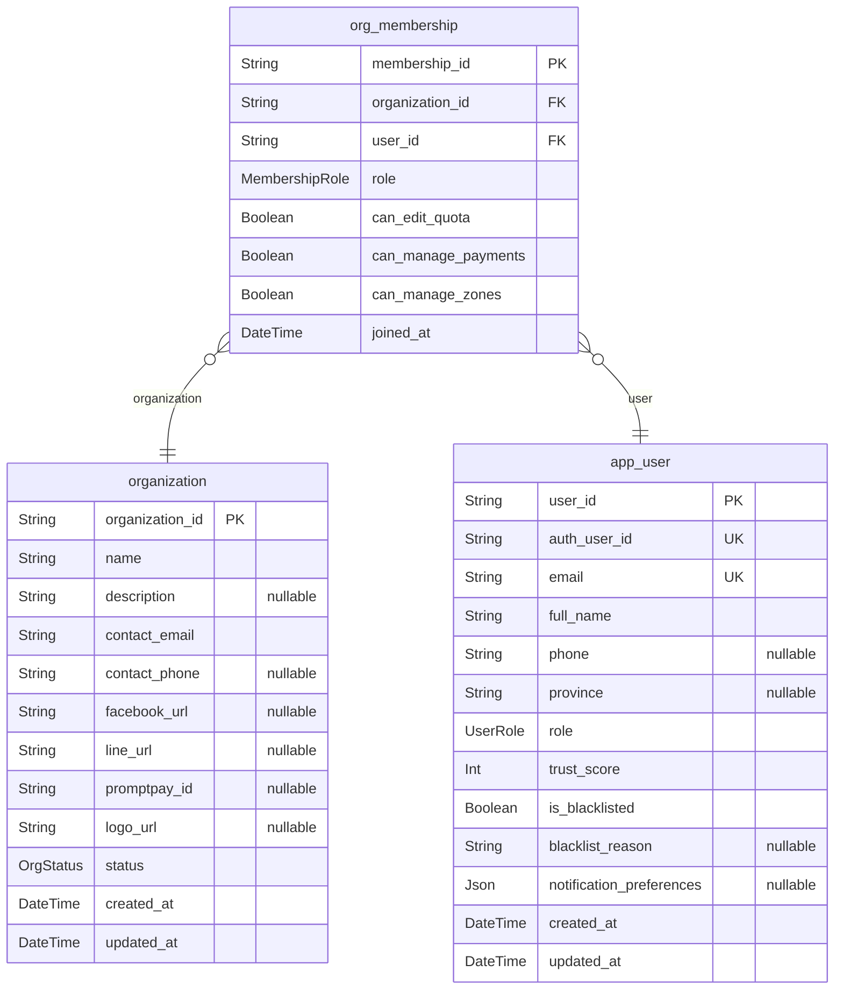
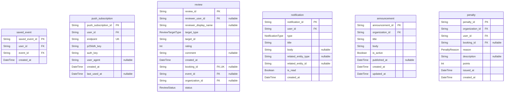
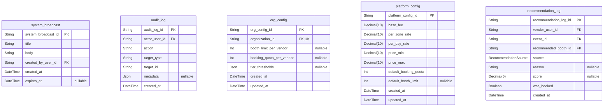
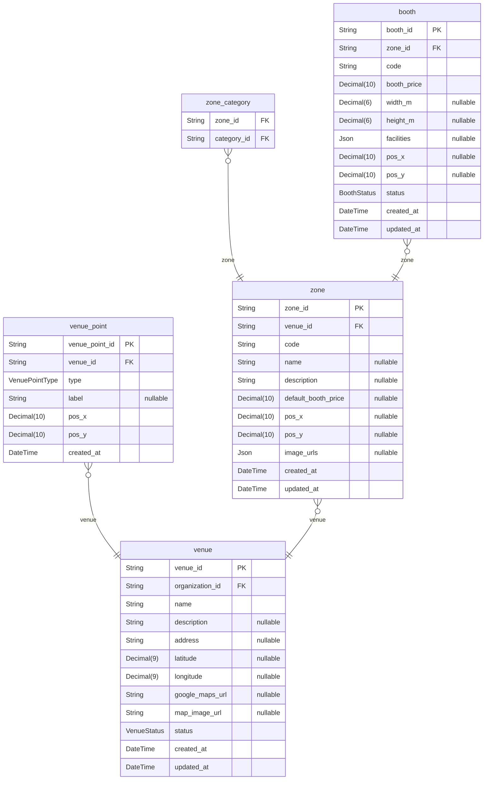
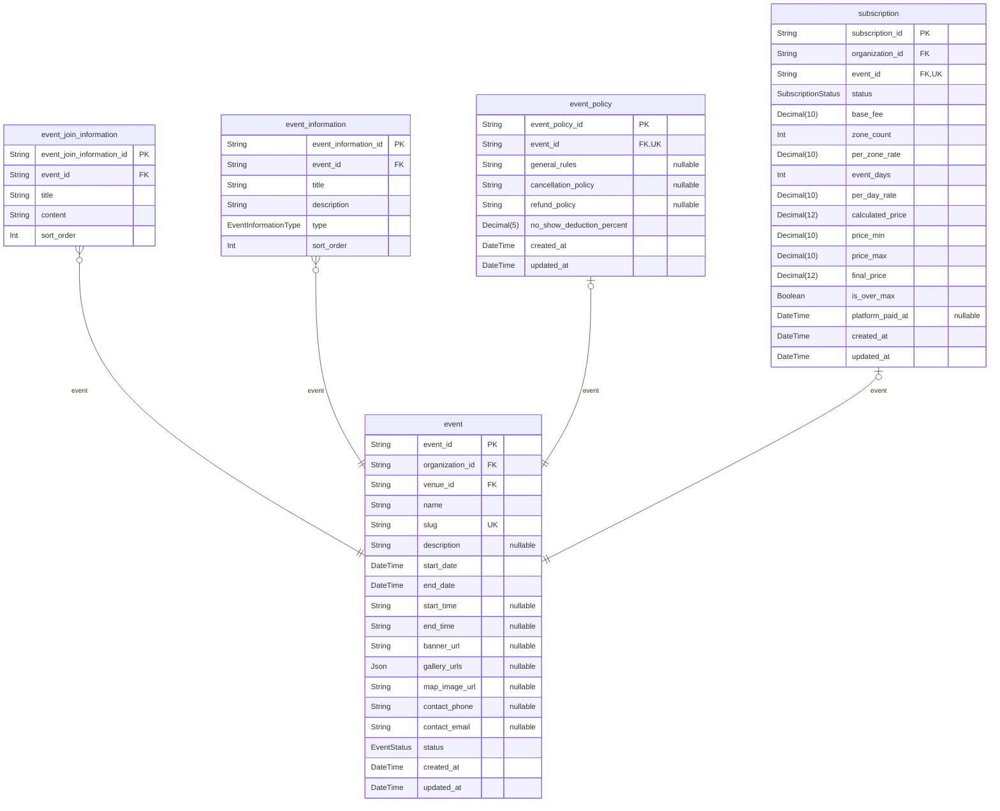
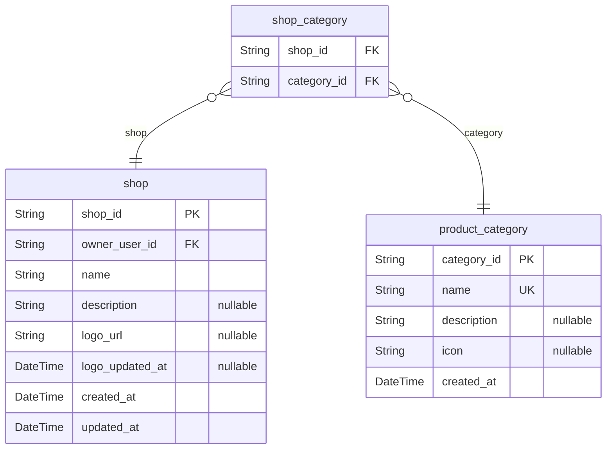
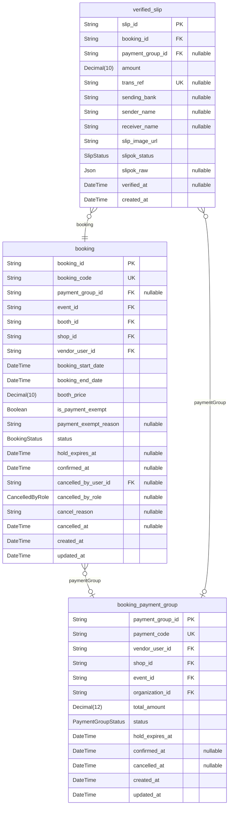
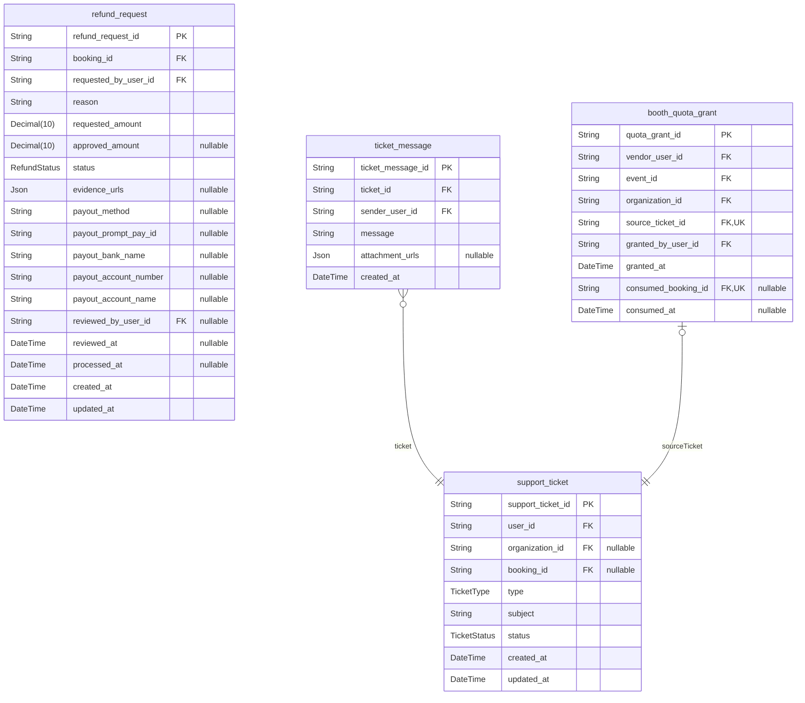

# SpaceLink Database

> Generated by [`prisma-markdown`](https://github.com/samchon/prisma-markdown)

- [Identity_Organization](#identity_organization)
- [Engagement_Notification](#engagement_notification)
- [Platform_Admin](#platform_admin)
- [Venue_Space](#venue_space)
- [Event](#event)
- [Shop_Category](#shop_category)
- [Booking_Payment](#booking_payment)
- [Refund_Support](#refund_support)

## Identity_Organization

### `organization`

Properties as follows:

- `organization_id`:
- `name`:
- `description`:
- `contact_email`:
- `contact_phone`:
- `facebook_url`:
- `line_url`:
- `promptpay_id`:
- `logo_url`:
- `status`:
- `created_at`:
- `updated_at`:

### `app_user`

Properties as follows:

- `user_id`:
- `auth_user_id`:
- `email`:
- `full_name`:
- `phone`:
- `province`:
- `role`:
- `trust_score`:
- `is_blacklisted`:
- `blacklist_reason`:
- `notification_preferences`:
- `created_at`:
- `updated_at`:

### `org_membership`

Properties as follows:

- `membership_id`:
- `organization_id`:
- `user_id`:
- `role`:
- `can_edit_quota`:
- `can_manage_payments`:
- `can_manage_zones`:
- `joined_at`:

## Engagement_Notification

### `saved_event`

Properties as follows:

- `saved_event_id`:
- `user_id`:
- `event_id`:
- `created_at`:

### `push_subscription`

Properties as follows:

- `push_subscription_id`:
- `user_id`:
- `endpoint`:
- `p256dh_key`:
- `auth_key`:
- `user_agent`:
- `created_at`:
- `last_used_at`:

### `review`

Properties as follows:

- `review_id`:
- `reviewer_user_id`:
- `reviewer_display_name`:
- `target_type`:
- `target_id`:
- `rating`:
- `comment`:
- `created_at`:
- `booking_id`:
- `event_id`:
- `organization_id`:
- `status`:

### `notification`

Properties as follows:

- `notification_id`:
- `user_id`:
- `type`:
- `title`:
- `body`:
- `related_entity_type`:
- `related_entity_id`:
- `is_read`:
- `created_at`:

### `announcement`

Properties as follows:

- `announcement_id`:
- `organization_id`:
- `title`:
- `body`:
- `is_active`:
- `published_at`:
- `created_at`:
- `updated_at`:

### `penalty`

Properties as follows:

- `penalty_id`:
- `organization_id`:
- `user_id`:
- `booking_id`:
- `reason`:
- `description`:
- `points`:
- `issued_at`:
- `created_at`:

## Platform_Admin

### `system_broadcast`

Properties as follows:

- `system_broadcast_id`:
- `title`:
- `body`:
- `created_by_user_id`:
- `created_at`:
- `expires_at`:

### `audit_log`

Properties as follows:

- `audit_log_id`:
- `actor_user_id`:
- `action`:
- `target_type`:
- `target_id`:
- `metadata`:
- `created_at`:

### `org_config`

Properties as follows:

- `org_config_id`:
- `organization_id`:
- `booth_limit_per_vendor`:
- `booking_quota_per_vendor`:
- `tier_thresholds`:
- `created_at`:
- `updated_at`:

### `platform_config`

Properties as follows:

- `platform_config_id`:
- `base_fee`:
- `per_zone_rate`:
- `per_day_rate`:
- `price_min`:
- `price_max`:
- `default_booking_quota`:
- `default_booth_limit`:
- `created_at`:
- `updated_at`:

### `recommendation_log`

Properties as follows:

- `recommendation_log_id`:
- `vendor_user_id`:
- `event_id`:
- `recommended_booth_id`:
- `source`:
- `reason`:
- `score`:
- `was_booked`:
- `created_at`:

## Venue_Space

### `venue`

Properties as follows:

- `venue_id`:
- `organization_id`:
- `name`:
- `description`:
- `address`:
- `latitude`:
- `longitude`:
- `google_maps_url`:
- `map_image_url`:
- `status`:
- `created_at`:
- `updated_at`:

### `venue_point`

Properties as follows:

- `venue_point_id`:
- `venue_id`:
- `type`:
- `label`:
- `pos_x`:
- `pos_y`:
- `created_at`:

### `zone`

Properties as follows:

- `zone_id`:
- `venue_id`:
- `code`:
- `name`:
- `description`:
- `default_booth_price`:
- `pos_x`:
- `pos_y`:
- `image_urls`:
- `created_at`:
- `updated_at`:

### `zone_category`

Properties as follows:

- `zone_id`:
- `category_id`:

### `booth`

Properties as follows:

- `booth_id`:
- `zone_id`:
- `code`:
- `booth_price`:
- `width_m`:
- `height_m`:
- `facilities`:
- `pos_x`:
- `pos_y`:
- `status`:
- `created_at`:
- `updated_at`:

## Event

### `event`

Properties as follows:

- `event_id`:
- `organization_id`:
- `venue_id`:
- `name`:
- `slug`:
- `description`:
- `start_date`:
- `end_date`:
- `start_time`:
- `end_time`:
- `banner_url`:
- `gallery_urls`:
- `map_image_url`:
- `contact_phone`:
- `contact_email`:
- `status`:
- `created_at`:
- `updated_at`:

### `event_join_information`

Properties as follows:

- `event_join_information_id`:
- `event_id`:
- `title`:
- `content`:
- `sort_order`:

### `event_information`

Properties as follows:

- `event_information_id`:
- `event_id`:
- `title`:
- `description`:
- `type`:
- `sort_order`:

### `event_policy`

Properties as follows:

- `event_policy_id`:
- `event_id`:
- `general_rules`:
- `cancellation_policy`:
- `refund_policy`:
- `no_show_deduction_percent`:
- `created_at`:
- `updated_at`:

### `subscription`

Properties as follows:

- `subscription_id`:
- `organization_id`:
- `event_id`:
- `status`:
- `base_fee`:
- `zone_count`:
- `per_zone_rate`:
- `event_days`:
- `per_day_rate`:
- `calculated_price`:
- `price_min`:
- `price_max`:
- `final_price`:
- `is_over_max`:
- `platform_paid_at`:
- `created_at`:
- `updated_at`:

## Shop_Category

### `shop`

Properties as follows:

- `shop_id`:
- `owner_user_id`:
- `name`:
- `description`:
- `logo_url`:
- `logo_updated_at`:
- `created_at`:
- `updated_at`:

### `shop_category`

Properties as follows:

- `shop_id`:
- `category_id`:

### `product_category`

Properties as follows:

- `category_id`:
- `name`:
- `description`:
- `icon`:
- `created_at`:

## Booking_Payment

### `booking_payment_group`

Properties as follows:

- `payment_group_id`:
- `payment_code`:
- `vendor_user_id`:
- `shop_id`:
- `event_id`:
- `organization_id`:
- `total_amount`:
- `status`:
- `hold_expires_at`:
- `confirmed_at`:
- `cancelled_at`:
- `created_at`:
- `updated_at`:

### `booking`

Properties as follows:

- `booking_id`:
- `booking_code`:
- `payment_group_id`:
- `event_id`:
- `booth_id`:
- `shop_id`:
- `vendor_user_id`:
- `booking_start_date`:
- `booking_end_date`:
- `booth_price`:
- `is_payment_exempt`:
- `payment_exempt_reason`:
- `status`:
- `hold_expires_at`:
- `confirmed_at`:
- `cancelled_by_user_id`:
- `cancelled_by_role`:
- `cancel_reason`:
- `cancelled_at`:
- `created_at`:
- `updated_at`:

### `verified_slip`

Properties as follows:

- `slip_id`:
- `booking_id`:
- `payment_group_id`:
- `amount`:
- `trans_ref`:
- `sending_bank`:
- `sender_name`:
- `receiver_name`:
- `slip_image_url`:
- `slipok_status`:
- `slipok_raw`:
- `verified_at`:
- `created_at`:

## Refund_Support

### `refund_request`

Properties as follows:

- `refund_request_id`:
- `booking_id`:
- `requested_by_user_id`:
- `reason`:
- `requested_amount`:
- `approved_amount`:
- `status`:
- `evidence_urls`:
- `payout_method`:
- `payout_prompt_pay_id`:
- `payout_bank_name`:
- `payout_account_number`:
- `payout_account_name`:
- `reviewed_by_user_id`:
- `reviewed_at`:
- `processed_at`:
- `created_at`:
- `updated_at`:

### `support_ticket`

Properties as follows:

- `support_ticket_id`:
- `user_id`:
- `organization_id`:
- `booking_id`:
- `type`:
- `subject`:
- `status`:
- `created_at`:
- `updated_at`:

### `ticket_message`

Properties as follows:

- `ticket_message_id`:
- `ticket_id`:
- `sender_user_id`:
- `message`:
- `attachment_urls`:
- `created_at`:

### `booth_quota_grant`

An approved booth-quota-increase request (SCRUM-182). A row is permission to
exceed the per-event quota by one booking, never a booking itself: the vendor
returns to the normal booking flow and picks an available booth, so approving
cannot beat another vendor to a booth in real time. `consumedBookingId` is
unique, which is what makes spending a grant atomic — two concurrent bookings
cannot both claim it. There is deliberately no `expiresAt`: a grant dies with
its event, because every booking path already refuses a closed event.

Properties as follows:

- `quota_grant_id`:
- `vendor_user_id`:
- `event_id`:
- `organization_id`:
- `source_ticket_id`:
- `granted_by_user_id`:
- `granted_at`:
- `consumed_booking_id`:
- `consumed_at`:
